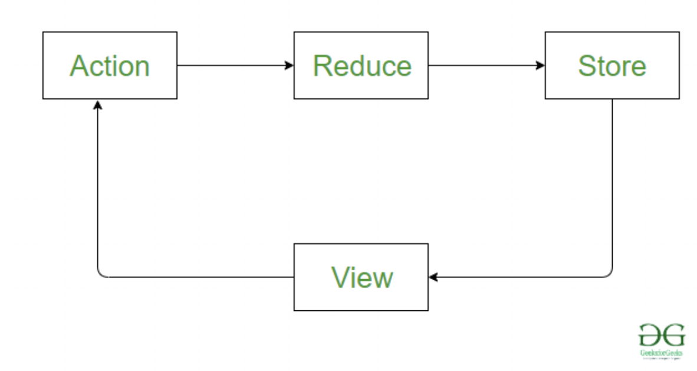

# redux

-   props와 state를 관리해주는 툴
-   컴포넌트 요소들에 전역적으로 접근할 수 있는 store를 제공한다

## data flow

  
 <br/>
 <br/>

-   unidirectional flow, 철저하게 한 방향으로만 흐른다.

1. **action**

    - 일어난 일을 기록하는 객체

    ```jsx
    {type : "LIKE_ARTICLE", articleID: 42}
    {type : "FETCH_USER_SUCCESS", response: {id:3, name: "Mary"}
    {type : "ADD_TODO", text: "Read the Redux docs"}
    ```

    type에 행동을 기록

2. **Reduce**

    ```jsx
    (PreviousState, action) ⇒ nextState
    ```

    - action을 통해 변하는 state를 설명
    - 인자로 전 state액션을 받아, 다음 state를 리턴
    - pure function이다
        - api콜이나 라우팅 변화를 해주면 안된다.
        - none pure function을 사용하면 안된다.
          e.g. `Date.now()` or `Math.random()`
          → 미들웨어 사용해서 객체, 함수 넣기
    - 여러 reducer를 combine으로 합치기

        ```jsx
        import { combineReducers } from "redux";
        //import user from "./user_reducer"

        const rootReducer = combineReducers({
            //user,
        });

        export default rootReducer;
        ```

3. Store
    - 전체적인 state를 감싼다
    - 메소드를 유지하고 관리해서 스테이트를 관리한다.
    - dispath를 사용해 액션을 통해 상태값을 변경할 수 있다.
    - 여러 reducer를 가질 수 있다.

## 실행

1. **설치**

    `npm i redux react-redux redux-promise redux-thunk`

    - redux-promise, redux-thunk
        - store에 promise 나 function 형태의 액션을 추가하기 위함.
        - dispatch에게 함수와 프라미스 관리법을 알려줌

2. **초기셋팅**

    1. `Provider`를 가져와서 `App`컴포넌트를 감싸준다.
    2. `applyMiddleware` 와 `createStore`를 가져온다
    3. `promiseMiddleware`와 `ReduxTunk`를 가져온다
    4. `_reducer/index.js` 를 셋팅한다.
    5. 구글익스텐션을 설치하고 store의 미들웨어로 넣어준다.

        [https://chrome.google.com/webstore/detail/redux-devtools/lmhkpmbekcpmknklioeibfkpmmfibljd?hl=ko-KR](https://chrome.google.com/webstore/detail/redux-devtools/lmhkpmbekcpmknklioeibfkpmmfibljd?hl=ko-KR)

    ```jsx
    //index.js

    ...
    import { Provider } from "react-redux";
    import { applyMiddleware, createStore } from "redux";
    import promiseMiddleware from "redux-promise";
    import ReduxThunk from "redux-thunk";
    import Reducer from "./_reducers";

    const createStoreWithMiddleware = applyMiddleware(
        promiseMiddleware,
        ReduxThunk
    )(createStore);

    ReactDOM.render(
        <React.StrictMode>
            <Provider
                store={createStoreWithMiddleware(
                    Reducer,
                    window.__REDUX_DEVTOOLS_EXTENSION__ &&
                        window.__REDUX_DEVTOOLS_EXTENSION__()
                )}
            >
                <App />
            </Provider>
        </React.StrictMode>,
        document.getElementById("root")
    );
    ```

    ```jsx
    //_reducer/index.js

    import { combineReducers } from "redux";
    //import user from "./user_reducer"

    const rootReducer = combineReducers({
        //user,
    });

    export default rootReducer;
    ```
