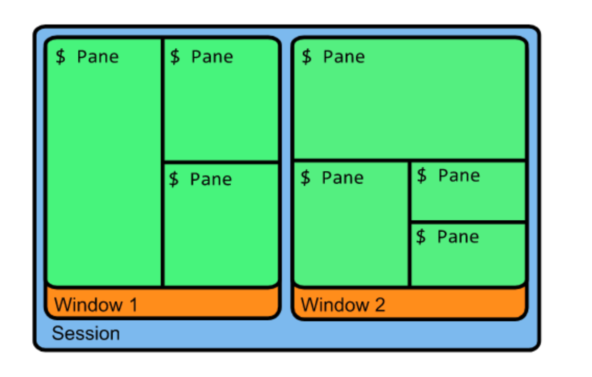

# tmux



## 개요

-   여러 터미널 세션을 활용할 수 있는 프로그램
-   터미널을 종료시켜도 이어서 작업할 수 있다.
-   프로그램을 백그라운드에서 계속 돌릴수도 있음.

<br/>

## session

-   tmux를 실행하는 작업 단위. 여러 윈도우로 구성됨.
-   attach, detach를 할 수 있으며, detach 되더라도 프로그램은 background에서 계속 진행됨

---

1. 세션 생성
    - `tmux new -s SESSION_NAME`
2. 세션과 함께 윈도우 생성
    - `tmux new -s SESSION_NAME -n WINDOW_NAME`
3. 세션 종료
    - `exit`
4. 세션 목록
    - `tmux ls`
5. 세션 이어하기
    - `tmux a`
    - `tmux attach -t SESSION_NUMBER (or SESSION_NAME)`
6. 세션 중단하기 (이어하기 가능 )
    - `tmux d`

<br/>

## window

-   터미널 화면으로 세션 내에서 탭처럼 사용 가능.

-   기본으로 `control + b`로 커맨드 입력을 시작함 -> `pre`로 지칭함

---

1. 새 창 열기
    - `pre + c`
2. 윈도우 목록 확인
    - `pre + w`
3. 윈도우 이동
    - 다음: `pre + n`
    - 이전: `pre + p`
    - 지정 이동: `pre + 숫자`
4. 윈도우 종료
    - `pre &`
    - `control + d`

<br/>

## pane

-   하나의 윈도우 내에서 화면 분할 가능.

---

1. 가로 화면 추가
    - `pre %`
2. 세로 화면 추가
    - `pre "`
3. 화면 포커스 이동
    - `pre o`
    - `pre art 화살표`
4. 화면 종료
    - `control d`
5. 화면 이동
    - `pre { }`
6. 스크롤 모드 전환
    - `pre [`
    - 빠져나오기 : `q`
7. 화면 삭제
    - `pre x`
    - `control + d`
8. 현재 pane 전체화면 전환
    - `pre z`

<br>
<br>

---

## tmux 마우스 사용

1. `~/.tmux.conf` 에 아래와같이 입력
2. `tmux source-file ~/.tmux.conf` 설정

```shell

set -g mouse on

setw -g mode-keys vi

# Use Alt-arrow keys without prefix key to switch panes
bind -n M-Left select-pane -L
bind -n M-Right select-pane -R
bind -n M-Up select-pane -U
bind -n M-Down select-pane -D

# Shift arrow to switch windows
bind -n S-Left  previous-window
bind -n S-Right next-window

# scrollback buffer size increase
set -g history-limit 100000

# change window order
bind-key -n C-S-Left swap-window -t -1
bind-key -n C-S-Right swap-window -t +1

# disable window name auto change
set-option -g allow-rename off

# bar color
set -g status-bg black
set -g status-fg white

# toggle pane title visibility
bind T run 'zsh -c "arr=( off top ) && tmux setw pane-border-status \${arr[\$(( \${arr[(I)#{pane-border-status}]} % 2 + 1 ))]}"'
# rename pane
bind t command-prompt -p "(rename-pane)" -I "#T" "select-pane -T '%%'"

bind -n WheelUpPane if-shell -F -t = "#{mouse_any_flag}" "send-keys -M" "if -Ft= '#{pane_in_mode}' 'send-keys -M' 'select-pane -t=; copy-mode -e; send-keys -M'"
bind -n WheelDownPane select-pane -t= \; send-keys -M

```

## 참고

-   참고 블로그 : https://seulcode.tistory.com/144
-   마우스 설정 스택오버플로우 글 : https://apple.stackexchange.com/questions/218553/iterm-tmux-isnt-allowing-me-to-scroll-up-with-the-mouse
